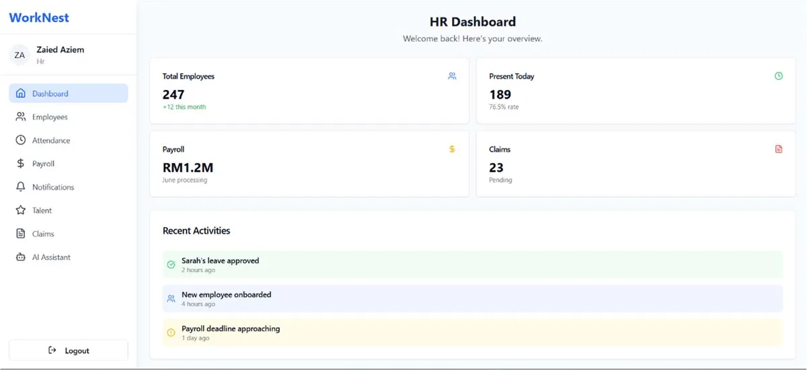
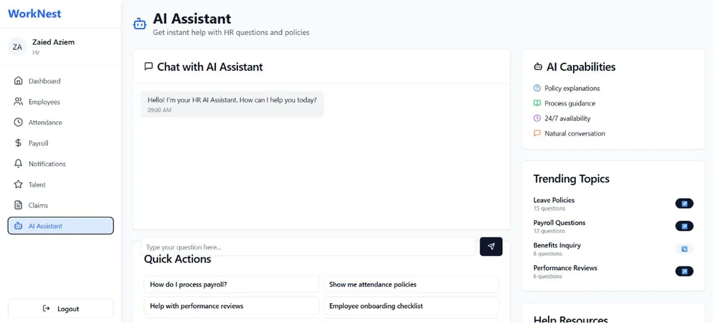
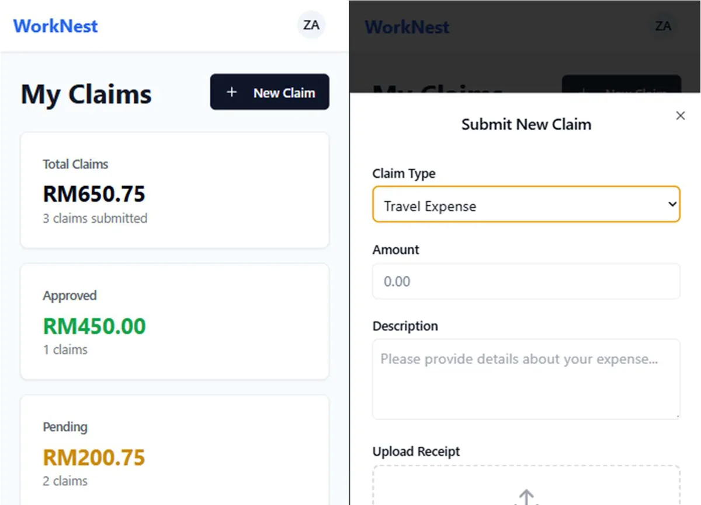

# WorkNest — Smart HR Management System

WorkNest is a human resource management system built for **Holistics Lab Sdn. Bhd.** as my final year
project. HR staff run the company from a web portal; employees handle their day-to-day HR tasks from a
mobile app. Both share one Supabase backend, and both include an AI assistant that answers questions
from the company's own HR policy documents.

This repository holds the **employee mobile app** (Flutter) and the **thesis**. The HR web portal
(ASP.NET Core MVC) lives in a separate repository.



| AI policy assistant | Mobile app — claims |
|---|---|
|  |  |

## Features

**Employee mobile app (this repo)**
- **Attendance** — clock in and out with location checks
- **Leave** — apply for leave and track balances and request status
- **Claims** — submit expense claims with receipts and follow their approval
- **Overtime** — request OT within office-hours and company-policy rules
- **Payslips** — view payslips and export them as PDF
- **Notifications** — updates when HR approves or rejects a request
- **AI assistant** — ask HR policy questions in plain language; answers are grounded in the uploaded policy document

**HR web portal (separate repo)**
- Dashboard, employee management and onboarding
- Attendance, leave, claims, OT and payroll management
- Knowledge base: upload policy documents that the AI assistant answers from
- Email notifications and PDF generation

## Tech stack

| Part | Technology |
|---|---|
| Mobile app | Flutter (Dart), MVVM with Provider |
| Web portal | ASP.NET Core 8 MVC, Entity Framework Core |
| Backend | Supabase: PostgreSQL, Auth, Storage |
| AI assistant | Groq (GPT-OSS 120B) via a Supabase Edge Function, retrieval over the company's policy document |

## Architecture

- **Domain-Driven Design** — the system is split into bounded contexts (attendance, leave, claims,
  payroll, notifications, knowledge base), and each has its own model and service.
- **MVVM in the mobile app** — `views/` render the UI, `viewmodels/` hold screen state and logic, and
  `services/` talk to Supabase. Views never call the backend directly.
- **One backend, two clients** — the web portal and the mobile app read and write the same Supabase
  database, so a leave approved on the web shows up on the phone immediately.
- **Hybrid Waterfall–Agile** — requirements and system design were done up front (SRS, UML), then
  the system was built in iterative sprints.

```
worknest/lib/
├── main.dart
├── models/        data classes: attendance, leave, claims, OT, payslips, users…
├── services/      Supabase calls, one per domain
├── viewmodels/    screen state and logic (Provider ChangeNotifiers)
├── views/
│   ├── screens/   one screen per feature
│   └── widgets/   feature-specific widgets
├── widgets/       shared widgets
└── theme/         app theme
supabase/functions/chat/   AI assistant Edge Function (holds the Groq key server-side)
Thesis/            final thesis (PDF)
```

## Running the mobile app

Requirements: Flutter SDK (Dart 3.8+), and a Supabase project with the WorkNest schema.

1. Create `worknest/.env`. It's gitignored, so it never gets committed:

   ```
   SUPABASE_URL=https://<your-project>.supabase.co
   SUPABASE_ANON_KEY=<your Supabase anon key>
   ```

2. Install packages and run:

   ```bash
   cd worknest
   flutter pub get
   flutter run
   ```

3. Run the unit tests:

   ```bash
   flutter test
   ```

## AI assistant backend

The chatbot runs as a Supabase Edge Function (`supabase/functions/chat`). The app calls it with the
signed-in user's session; the function checks the user, picks the relevant pages of the policy
document, and calls Groq. The Groq API key is a Supabase secret, so it is never shipped in the APK.

Deploy it with the [Supabase CLI](https://supabase.com/docs/guides/cli):

```bash
supabase login
supabase secrets set GROQ_API_KEY=<your Groq API key> --project-ref <your-project-ref>
supabase functions deploy chat --project-ref <your-project-ref>
```

## Thesis

The full write-up is in [`Thesis/correction_thesis.pdf`](Thesis/correction_thesis.pdf). It covers
requirements, system design (use case, sequence, activity, state and class diagrams), implementation,
and evaluation of the AI assistant and the system's usability.
